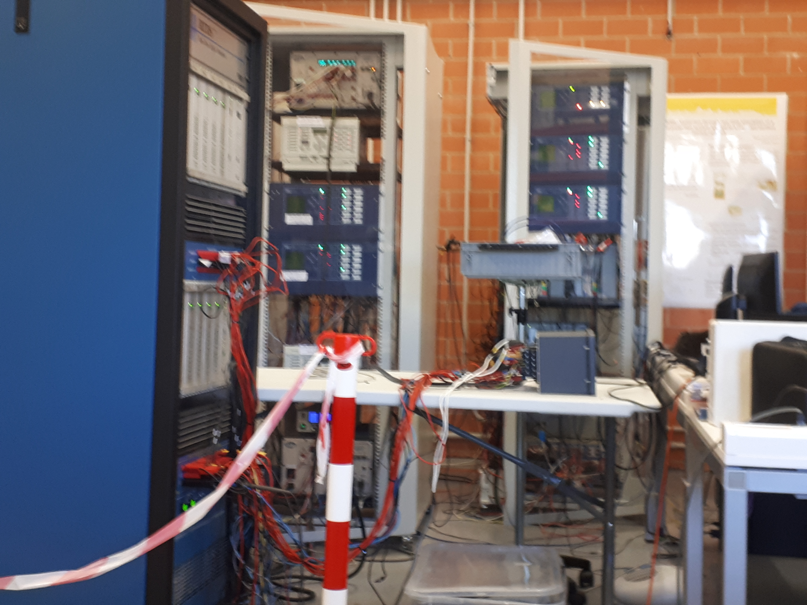
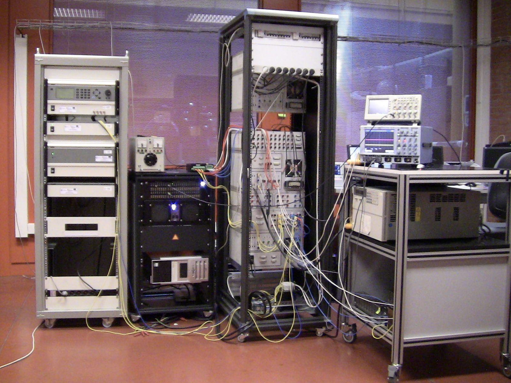

<!-- Main -->

<!-- One -->
<section id="one">
	

		<header class="major">
			<h2>Acerca de los lugares donde he trabajado...</h2>
		</header>
		
Disfruto de desarrollar software y hardware enfocados a los sistemas eléctricos de potencia con generación renovable. Mi pasión los sistemas en tiempo real.

		<ul class="actions">
			<li><a href="https://github.com/lg-gonzalez-juarez" class="button next">my github</a></li>
		</ul>
	

</section>
	

<!-- Two -->
<section id="two" class="spotlights">

	<section>
	
	

	

	<header class="major">
	<h3>Altran</h3>
	</header>
        

Desarrollo de algoritmos de control de plantas eólicas, solares y dispositivos de compensación en sistemas de generación distribuida reales. Diseño de pruebas de validación automatizadas de algoritmia de control enfocada a sistemas de integración continua.

- Consultora externa de Siemens Gamesa
- Diseño de pruebas de validación de sistemas de control 
- Modelado y simulación de sistemas eólicos, solares y dispositivos de compensación
- Diseño de aplicaciones GUIDE integradas en la plataforma Matlab-Simulink para validaciones de sistemas de control en tiempo real

	<ul class="actions">
	<li><a href="https://www.altran.com" class="button">website Altran</a></li>
	</ul>
	

	

	</section>

	<section>
	
	

	

	<header class="major">
	<h3>Centro de investigación de recursos y consumos energéticos (CIRCE)</h3>
	</header>
        
Diseño y aplicación de pruebas a equipos de subestaciones eléctricas mediante el empleo de equipos Hardware in the Loop dentro del proyecto IdEAS (interoperabilidad de equipos de automatización de subestaciones).

	<ul class="actions">
	<li><a href="http://www.fcirce.es/" class="button">website CIRCE</a></li>
	</ul>
	

	

	</section>

	<section>
	
	

	

	<header class="major">
		<h3>Universidad Carlos III Madrid</h3>
	</header>
	
Diseño, desarrollo y puesta en servicio de una red distribuida con control de orden fraccionario. Validación del sistema de control con simuladores Hardware in the loop y power in the loop.

	<ul class="actions">
	<li><a href="https://www.uc3m.es/" class="button">website UC3M</a></li>
	</ul>
	

	

	</section>

	<section>
		
		
	        

			

			<header class="major">		
				<h3>RIAMA</h3>
			</header>
				
Puede haber texto

			<ul class="actions">
			<li><a href="https://es.wikipedia.org/wiki/Petr%C3%B3leos_Mexicanos" 				class="button">wiki RIAMA</a></li></ul>
			

		

	</section>

</section>

<!-- Three -->
<section id="three">
	

		<header class="major">
			<h2>Proyectos Desarrollados</h2>
		</header>
		
 Sistema de plataformas flotantes

	

</section>

